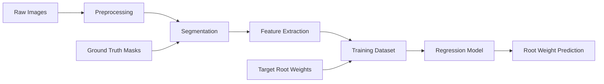

# Greenscale Architecture

```mermaid
flowchart LR
    A[Raw Images]
    B[Ground Truth Masks]
    C[Target Root Weights]

    A --> D[Preprocessing]
    D --> E[Segmentation]
    B --> E

    E --> F[Feature Extraction]
    F --> G[Training Dataset]
    C --> G

    G --> H[Regression Model]
    H --> I[Root Weight Prediction]
```
